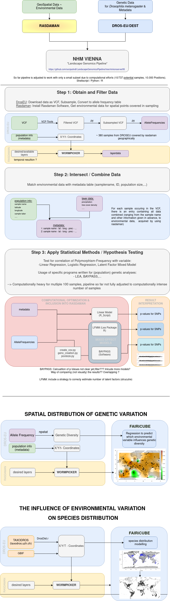

# Landscape Genomics Pipeline 

This repository is supposed to hold documentation on the Pipeline used for the UC3 Project of FAIRiCUBE. 

## Objectives

This pipeline performs several landscape-genomics analysis on a SNP called data set. 

## Preliminary Results on Test Data

---

## Requirements
- VCFTools (Citation)
- Baypass2.3 (Citation)
- LEA R-Package (Citation)
- (rasdaman)

## Workflow Overview 

0) Setup environment
1) Download and define data
2) Subsample VCF for chromosomal arms (computational reasons while pipeline development)
2.1) Remove Polyploides
2.2) Subsample 10k Variants
2.3) Convert to Allele Frequencies
3) Define Metadata / Covariates for analyses
4) Linear Model 
5) Latent Factor Mixed Model
6) Baypass Analysis
7) Result Comparison 
x) The basic workflow can be performed according to [main.sh](d/d/main.sh)

---

---

## Detail
### Make sure the following aspects are covered in each step of the analysis: 

0) SetUp
- Provide a file with the names of the samples you want to include into the analysis.
- Define the chromosomal arm you want to perform the analysis on.
- Download VFC file, metadata file and worldclim data.
- Declare your environment variables.

0.0) IN PROGRESS (not in the main.sh yet)
- Get geospatial data from desired layers from rasdaman. 
- Append layer data and create a "final metadata file". 

